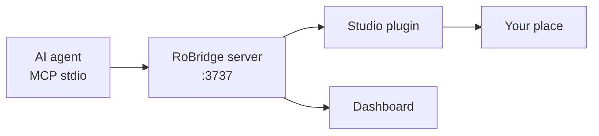

# RoBridge

[](docs/README.md)
[](plugin/RoBridge.lua)
[](docs/tools.md)
[](LICENSE)
[](CHANGELOG.md)

A free, open, **local** MCP server that lets AI agents (Cursor, Claude, any MCP client) drive **Roblox Studio** — DataModel, scripts, terrain, lighting, UI, and playtests — plus a dashboard at [http://127.0.0.1:3737](http://127.0.0.1:3737). All tools included. No Pro tier.



## Docs

Everything lives in this repo (no separate docs site):

| | |
| --- | --- |
| [Install](docs/install.md) | Build, plugin, HTTP, Mesh/Image APIs |
| [MCP setup](docs/mcp.md) | Cursor, Claude Desktop, Claude Code, generic stdio |
| [Playtesting](docs/playtesting.md) | `run_test`, Play/Run, input |
| [Dashboard](docs/dashboard.md) | Local UI on `:3737` |
| [Tools](docs/tools.md) | Full action + param reference |
| [Troubleshooting](docs/troubleshooting.md) | Fix lines, stuck Play |
| [Limits](docs/limits.md) | One port, InsertService, no Open Cloud |
| [Changelog](CHANGELOG.md) | Server 0.1.6 / plugin 0.1.8 |

Clone this repo and run it locally. It is **not** published to the public npm registry yet, so `npx robridge@latest` will not work until that changes.

## Works with

Cursor, Claude Desktop, Claude Code, and any stdio MCP client (VS Code Copilot, Cline, Windsurf). Same spawn: `node` + absolute path to `dist/index.js` (empty argv — no subcommands). Config files and reload notes: [docs/mcp.md](docs/mcp.md).

## First run

```bash
npm install && npm run build && npx robridge init
```

That copies the Studio plugin into the Roblox Plugins folder and prints MCP spawn snippets. Plugin only: `npx robridge install-plugin`. Snippets only (does not start the server): `npx robridge mcp`.

Then restart Roblox Studio (or refresh Plugins), **Allow HTTP** to `127.0.0.1`, and (for screenshots) **Allow Mesh / Image APIs**.

Plugin destination:

| OS | Path |
| --- | --- |
| macOS | `~/Documents/Roblox/Plugins/RoBridge.lua` |
| Windows | `%LOCALAPPDATA%\Roblox\Plugins\RoBridge.lua` |

Claude Code:

```bash
claude mcp add --scope user RoBridge -- node /absolute/path/to/RoBridge/dist/index.js
```

Cursor / Claude Desktop — `~/.cursor/mcp.json` (absolute path):

```json
{
  "mcpServers": {
    "RoBridge": {
      "command": "node",
      "args": ["/absolute/path/to/RoBridge/dist/index.js"]
    }
  }
}
```

`npx robridge mcp` prints these blocks with your real path. Other clients: [MCP setup](docs/mcp.md). Reload the MCP server after each rebuild. Claude Desktop: fully quit and reopen.

If this package is published later: `npx robridge@latest init`.

Dashboard: [http://127.0.0.1:3737](http://127.0.0.1:3737). Dashboard only: `node dist/index.js --no-mcp`.

One process owns `:3737`. Extra MCP clients (Cursor + Claude together) **forward** to that owner and share the same Studio session.

## Tools (24, all free)

MCP `tools/list` and HTTP `/api/tools` share the same `defineTool` Zod shapes. Full param tables: [docs/tools.md](docs/tools.md).

| Tool | Actions |
| --- | --- |
| `query_instances` | get, children, descendants, ancestors, find_child, find_descendant, wait_for_child, search_class, search_name, search_property, search_tag, class_info, file_tree, project_structure |
| `mutate_instances` | create, create_with_props, delete, clone, move, rename, pivot, create_tree, mass_create, mass_delete, mass_duplicate, smart_duplicate, scatter |
| `manage_properties` | get, get_all, set, set_many / set_multiple, attributes/tags (incl. get_tagged, check_tag), set_relative, set_calculated, mass_set, mass_get, modify_children |
| `manage_scripts` | get_source, set_source, create, delete, list, search, replace, edit_lines, edit_replace, edit_insert, edit_delete, validate, get_dependencies |
| `manage_ui` | design_brief, create_tree, update, list, inspect, list_interactive, preview, hide_preview, click, type_text, get_abs, check, delete |
| `manage_lighting` | get, set / lighting, set_time / time, atmosphere, sky, terrain_props, mood, add_effect, clear_effects |
| `manage_selection` | get, set, add, remove, clear, details, cached, context, watch |
| `manage_camera` | get / info, set, focus / focus_path, focus_position, suggest, zoom_extents, screenshot, record, record_stop |
| `manage_tween` | create, play, pause, resume, cancel / stop_all |
| `manage_audio` | create, play, pause, resume, stop, stop_all, list, set, set_listener |
| `manage_animation` | create, list, load, play, stop, stop_all, get_tracks |
| `manage_physics` | anchor, unanchor, set_collide, weld, get_mass, set_physical_properties, create_constraint, register_group, set_collidable, get_groups |
| `manage_effects` | create, remove / clear, list, emit, toggle |
| `manage_terrain` | fill_block/ball/cylinder/wedge, clear, clear_region, clear_bounds, replace_material, colors_get/set, read/write voxels, generate, smooth, get_info |
| `spatial_query` | raycast, multi_raycast, in_radius, in_box, ground_height / find_ground, check_placement, scan_area, find_flat, find_spawn, analyze_walkable, spatial_map, find_space, bounds, snap_grid, collision |
| `manage_assets` | search, preview / info, insert / insert_free / insert_package, search_insert, export/import library, review_model, generate_model, upload_asset, generate_thumbnail |
| `manage_sync` | export_scripts, status / status_current_place, history, directions, read_file, write_file, progress |
| `workspace_state` | summary, counts, sync, snapshot, changes, clear_history, viewport, metadata, scripts, selection_info, clear_cache |
| `manage_logs` | get, errors, clear |
| `system_info` | info (default), ping, connection, place_info, services, usage, preflight |
| `manage_studio` | get_mode, play_status, play_start, play_stop, play_pause, play_resume, **run_test**, toggle_ui_preview, test_profile_get/set/reset, experience_language_get/set, undo, redo, set_waypoint, save_prompt |
| `manage_input` | click_at, click_path, key, type_text, walk_to, click_world, walk_and_click |
| `batch_execute` | run several tool calls in one request (optional waypoint / stopOnError) |
| `execute_luau` | run arbitrary Luau at plugin security level |

`manage_studio.run_test` injects Luau, **stops leftover Play first**, starts Play (or Run), collects `[ROBRIDGE_TEST]` logs, stops, and writes a report. Prefer it over `play_start` + `manage_logs` + `play_stop`.

`system_info.preflight` is a read-only Studio checklist (edit mode, HttpService, loadstring, Mesh/Image APIs) with fix instructions.

### Value conventions

Property values accept plain JSON: `[x,y,z]` for Vector3/CFrame position, 12 numbers for full CFrame, `"#ff0000"` or `[r,g,b]` for Color3, `[xs,xo,ys,yo]` for UDim2, `"Enum.Material.Neon"` or `"Neon"` for enums, path strings for Instance references.

Instance paths look like `game.Workspace.Model.Part` or `Workspace/Model/Part`. Prefer `rbId` from a prior summary when names collide. Never invent `rbxassetid` values — `manage_assets.search` first.

## Configuration

| Env var | Default | Purpose |
| --- | --- | --- |
| `ROBRIDGE_PORT` | `3737` | Dashboard + plugin bridge port |

The plugin reads `RoBridgeHost`/`RoBridgePort` plugin settings if you need a non-default port.

Dump the shipped catalog (no Studio needed): `node dist/index.js --dump-catalog`. Live HTTP: [http://127.0.0.1:3737/api/tools](http://127.0.0.1:3737/api/tools). Schema check: `npm run test:schema`.

## Troubleshooting

| Problem | What to do |
| --- | --- |
| No Studio session | Open the place in Studio with the plugin; click **Allow** for HTTP to `127.0.0.1`. |
| `execute_luau` / loadstring in Play | Edit-only. Use `run_test` / play agents, or `play_stop` first. |
| Stuck Play | Press **Stop** in Studio (or `manage_studio.play_stop`), then retry. |
| CaptureService / screenshot failed | File → Game Settings → Security → Allow Mesh / Image APIs. One in-flight shot; ~1.5–2 fps is expected. |
| Play started but agent never polls | Game Settings → Security → Allow HTTP Requests. |
| Stale dashboard / port in use | One process owns `:3737`. Stop the owner MCP/Node process and start once. |

Tool errors append a `Fix:` line when the server recognizes the failure. Run `system_info` `preflight` for a checklist. More: [docs/troubleshooting.md](docs/troubleshooting.md).

## Limits

- One RoBridge instance owns `:3737`; extra MCP clients **forward** to that owner.
- `manage_assets` insert uses `InsertService:LoadAsset` (asset must be free or owned by you).
- Open Cloud asset upload is not included. `upload_asset` is Studio `AssetService:CreateAssetAsync` (`confirm=true`).
- Not a crate game. The product is the local MCP bridge.

See [docs/limits.md](docs/limits.md).

## Repository

| Path | |
| --- | --- |
| `src/` | MCP + HTTP server (`VERSION` 0.1.6) |
| `plugin/` | Studio plugin (`VERSION` 0.1.8) |
| `ui/` | Dashboard served at [http://127.0.0.1:3737](http://127.0.0.1:3737) |
| `docs/` | Install, MCP, playtesting, tools, limits |
| `scripts/` | Plugin install, catalog extract, tests |

`npm test` runs `test:schema` and `test:hints` (no Studio). Play/UI tests need an open place.

## License

MIT. See [LICENSE](LICENSE).
